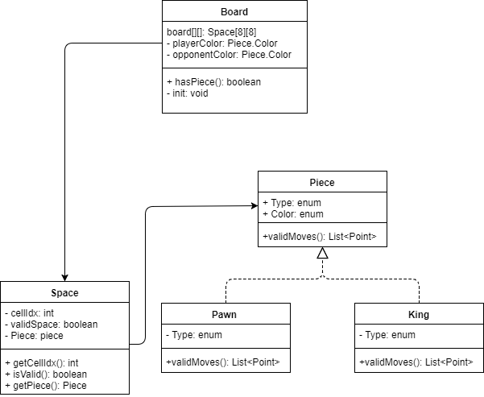

# PROJECT Design Documentation

# Team Information
* Team name: KOTD (Team d)
* Team members
    * Robert Kurdziel
    * AJ Nagashima
    * William Raffaelle
    * George Pinal
    * Kerri Zalba

## Executive Summary

This is a summary of the project.

### Purpose
Create an online checkers game.

### Glossary and Acronyms

| Term | Definition |

|------|------------|

| VO | Value Object |

| MVP | Minimum Viable Product |

## Requirements

This section describes the features of the application.

### Definition of MVP
A game of checkers can be played by the official American rule set between two people

### MVP Features
* Sign-in: Players must be able to sign into the checkers site
* Game start: Players must be able to start a game with another person
* Gameplay: Players must be able to play a game that follows the American checkers rule set
* Resignation: Players must be able to resign from a game they no longer wish to play

### Roadmap of Enhancements
* Spectate: Players must be able to watch an ongoing game between two other players
* Replay: Players must be able to save previous matches and watch it again

## Application Domain

This section describes the application domain.

### Overview of Major Domain Areas

The application has a Board and a BoardView. The board is of type Space and the board view is used to show
the board for the current player. Each Space object on the board can contain a Piece if it is a white piece. Piece is
an abstract class; the two types of pieces are type Pawn and type King. 

### Details of each Domain Area

It is important to note that Space has its own validMoves method. This returns the valid moves a Piece can move from
that space. The method determines whether the piece is of type Pawn or King and carries out the respective move checking.

## Architecture

This section describes the application architecture.

### Summary

The application of the program spans three tiers: appl, model, ui. Users interact with the UI by moving 
pieces on the board. The application tier holds the logic that allows moves to be valid. The model holds the core 
domain, which in this case is the game board, its spaces, and the spaces pieces. 

### Overview of User Interface

The program begins by making a GET to the home page. The player signs in which invokes a POST sign in. If successful,
the player can then choose another signed in player to play against and a GET is made to the game page. Here the player
can make a move. First, there is a POST to validate the move, then there is a POST to submit the move.

### Tier UI

The UI tier allows the player to sign in, play games, make moves, and resign. GET routes handle getting the different
pages (Home, SignIn, Game). POST routes allow the player to sign in, make moves and resign.

### Tier model

The model tier hold the board object. The board is comprised of Spaces which all have a reference to the Piece object 
on them. The King and Pawn classes make sure that the proper move functionality in used.

### Tier appl

The appl tier manages the games that are created in GameLobby and PlayerLobby. When players sign in they are sent to the 
PlayerLobby, and when challenged that are sent to the GameLobby. The GameLobby must assign players to games and also handle
the case that somebody resigns. 

## Sub-system UI components

The UI components GetHomeRoute, GetSignInRoute, and GetGameRoute ensure that the user can view the game. 

### Purpose of the sub-system

These components provide a game page for the user to view and interact with. 

### Static models

### Dynamic models