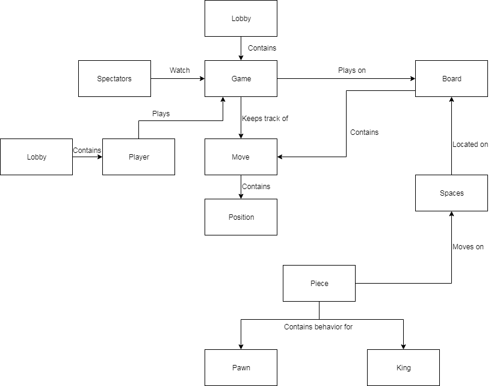
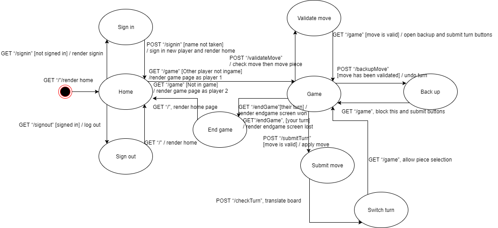

# PROJECT Design Documentation

# Team Information
* Team name: KOTD (Team d)
* Team members
    * Robert Kurdziel
    * AJ Nagashima
    * William Raffaelle
    * George Pinal
    * Kerri Zalba

## Executive Summary

&nbsp;&nbsp;&nbsp;&nbsp;The application must be a web-based checkers game. The application must allow players to sign in and play checkers with one another. Using his or her browser, the user 
must play a game by dragging and dropping pieces onto the board. In addition to these features, we want to add the following features: allow users
 to spectate going games and save matches to watch them later. These additional features are listed in the Roadmap
 of Enhancements.

### &nbsp;Purpose
&nbsp;&nbsp;&nbsp;&nbsp;Create an online checkers game that users can play in their browsers. The interface should be easy to use
and playing a game should be seamless and simple. Additionally, enhancement features should be added
to increase user interaction. 

### &nbsp;Glossary and Acronyms

| Term | Definition |

|------|------------|

| VO | Value Object |

| MVP | Minimum Viable Product |

## Requirements

&nbsp;&nbsp;&nbsp;&nbsp;The features we have in our application include:

* Creating an alphanumeric username that is not already taken
* Challenge a player to a game when they are both not already in one. In which case it pulls both players into a game page together
* When one player is already in a game it makes the other player wait to play a game with them
* Allows the players to take turns moving their pieces
* Allows players to capture each others pieces
* Allows pieces to become king when the end of the board is reached
* Allows players to win or lose a game
* Allows players to log out

### &nbsp;Definition of MVP
&nbsp;&nbsp;&nbsp;&nbsp;&nbsp;&nbsp;&nbsp;&nbsp;Minimum Viable Product

### &nbsp;MVP Features
* Sign-in: Players must be able to sign into the checkers site using a non-taken alphanumeric username. User story(s): Player Sign-in (8).
* Game start: Players must be able to start a game with another person, given that both are not already in a game. 
User story(s): Start a Game (13).
* Gameplay: Players must be able to play a game that follows the American checkers rules. Players can capture pieces, become kings, and 
and win games. User story(s): Becoming King (2 point), Player Movement (13 points), Capture a piece (3 points).

### &nbsp;Roadmap of Enhancements
* Spectate: Players must be able to watch an ongoing game between two other players
* Replay: Players must be able to save previous matches and watch it again

## Application Domain

### &nbsp;Domain Model

* The application contains lobby which keeps track of all players. 
* A player plays a game of checkers. 
* The applications also contains spectators that can watch games. 
* All games are contained within a lobby. 
* Games are played on a board. A game keeps track of all move's the players make. 
* The board contains the moves that can be made. 
* Each move contains a position (start and end). 
* There are spaces located on the board. 
* Pieces move on these spaces. The two types of pieces are pawns and kings.
* The application tier holds the logic that allows moves to be valid.

All of these entities and relationships are shown in the domain model. 

### &nbsp;Overview of Major Domain Areas

* Players and spectators: Users can choose to either play a game or spectate and ongoing game. A lobby
contains all players.
* Game: Players are taken to a game when they want to face each other. The game must keep track of all
 moves each player makes so it can determine the winner.
* Pieces: The player moves the pieces to play a game. A piece is either a pawn or a king.
* Board: The board is made up of spaces. The player drags and drops the pieces on the board to play. 

### &nbsp;Details of each Domain Area

* Players and spectators:

&nbsp;&nbsp;&nbsp;&nbsp;&nbsp;&nbsp;&nbsp;&nbsp;A lobby contains all the players. It keeps track
of whether each player is in a game or not. Two players that are not in a game may face each other. 
Players play games by moving the pieces on the game board. Players may resign and leave from games whenever.
Spectators can watch a game until it is over. They cannot play while spectating.

* Game:

&nbsp;&nbsp;&nbsp;&nbsp;&nbsp;&nbsp;&nbsp;&nbsp;A lobby contains all games that are in progress. It keeps
track of whether or not the game is over. Games are played by two players that take turns. Each time a player
makes a move their turn is over. The game keeps track of every move, as well as captures. When a player is out of 
moves or all of their pieces have been captured, the game is over. 

* Pieces:

&nbsp;&nbsp;&nbsp;&nbsp;&nbsp;&nbsp;&nbsp;&nbsp;A piece is a movable object that the player interacts with. Each player
moves their own set of pieces to travel on the game board and capture their opponents pieces. Each piece is either a pawn
or a king. The valid moves a piece can make is determined by its type. 

* Board: 

&nbsp;&nbsp;&nbsp;&nbsp;&nbsp;&nbsp;&nbsp;&nbsp;The board is what the game is played on. The board contains spaces, some of which 
have pieces. It determines whether or not a certain move can be made. If the player tries to make an invalid move, they must
try again to make a valid move. 

## Architecture

&nbsp;&nbsp;&nbsp;&nbsp;This section describes the application's architecture, and lays out the states of its behavior.

### &nbsp;Summary

&nbsp;&nbsp;&nbsp;&nbsp;The application of the program spans three tiers: application, model, and ui. Users interact with the ui by moving
pieces on the board. The model holds the core domain, which in this case is the game board, its spaces, and the space's pieces. 

### &nbsp;Overview of User Interface

&nbsp;&nbsp;&nbsp;&nbsp;As shown in the state diagram above, the program begins by making a GET to the home page. The player signs in which invokes a POST sign in. If successful,
the player can then choose another signed in player to play against and a GET is made to the game page. Here the player
can make a move. First, there is a POST to validate the move, then there is a POST to submit the move. Players can also back up a move after it has been
validated, which is seen as a POST in the state diagram. After the move has been submitted, there is a POST to translate the board (refer to Switch turn
state in diagram). Lastly, given that there is a current game and one of the end game conditions is meet, there is a GET to end the game. The end screen rendered
is determined by whether it was the current player's turn or not, as denoted by the guards in the sequence diagram.

### &nbsp;Tier UI

&nbsp;&nbsp;&nbsp;&nbsp;The UI tier allows the player to sign in, sign out, play games, make moves, and to resign. Additionally, they allow users to spectate on going games
and to play back saved games. GET routes handle getting the different pages (Home, SignIn, Game, EndGame). While on the home page, POST routes allow the player to sign in. While on the game page, POST routes allow the 
player to make moves, backup moves, and resign. 

Users can also spectate games, which is handled by a POST route to the game page. After a game is finished, users may save a game to watch later which is handled by a POST
route. In replay mode, a POST route handles stepping forward in the replay, and another POST route handles stepping backwards in the replay. Users can also delete games, handled by 
a different POST route. 

### &nbsp;Tier Model

&nbsp;&nbsp;&nbsp;&nbsp;The model tier hold the board object. The board is comprised of Spaces which all have a reference to the Piece object
on them. The King and Pawn classes make sure that the proper move functionality in used.

### &nbsp;Tier Application

&nbsp;&nbsp;&nbsp;&nbsp;The appl tier manages the games that are created in GameLobby and PlayerLobby. When players sign in they are sent to the
PlayerLobby, and when challenged that are sent to the GameLobby. The GameLobby must assign players to games and also handle
the case that somebody resigns. 

## Sub-systems

&nbsp;&nbsp;&nbsp;&nbsp;The UI components GetHomeRoute, GetSignInRoute, and GetGameRoute ensure that the user can view the game, and the
Application component gamelobby serves to provide additional data to streamline their interactions in determining movement of players from
home to game. The Model components Board, Row, and Space contain important logic for the game itself.

### &nbsp;Purpose of the sub-systems

#### &nbsp;&nbsp; UI Home, Signin, and Game routes
&nbsp;&nbsp;&nbsp;&nbsp;&nbsp;&nbsp;&nbsp;&nbsp;These components provide a game page for the user to view and interact with. Beyond just fulfilling this duty,
they interact with one another while checking the status of the current player versus the gamelobby in the application, which is important in doing two things:
adding players to their respective games when they are challenged by or have selected a suitable opponent, and ensuring that players cannot be left behind when
clicking out of the game and attempting to reload into the homepage in the middle of a game.

#### &nbsp;&nbsp; Model Board & Subcomponents
&nbsp;&nbsp;&nbsp;&nbsp;These components interact in their initialization to produce a board suitable to follow movement and jumping logic.
Board's constructor produces a square matrix of size 8 of unique Space Objects.
Board's methods validMoves and validJumps work seperately in constructing a list
of legal checkers moves using the type of piece held in the Spaces relevant to
the state of the board. These methods are called by updateMoveList, which is
called by getMoves, which is the exit point of the subsystem via proxy of its
information expert, Board.

### &nbsp;Static models

### &nbsp;Dynamic models
#### &nbsp;&nbsp;State Chart 
&nbsp;&nbsp;&nbsp;&nbsp;
#### &nbsp;&nbsp;Sequence Diagram 
&nbsp;&nbsp;&nbsp;&nbsp;
