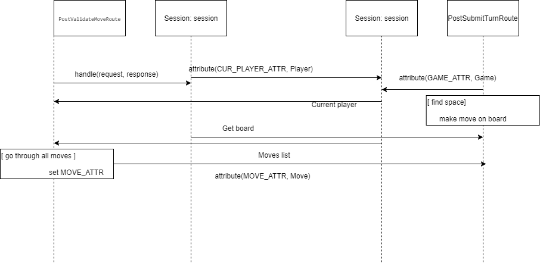
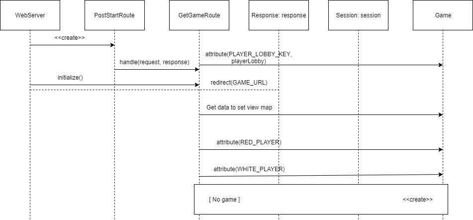
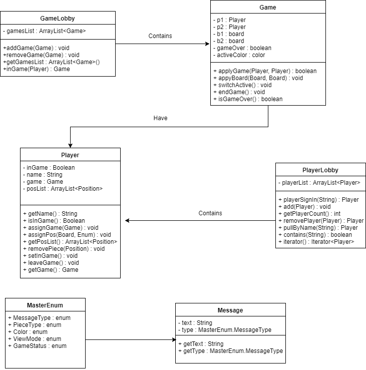

# PROJECT Design Documentation

# Team Information
* Team name: KOTD (Team d)
* Team members
    * Robert Kurdziel
    * AJ Nagashima
    * William Raffaelle
    * George Pinal
    * Kerri Zalba

## Executive Summary

&nbsp;&nbsp;&nbsp;&nbsp;The application must be a web-based checkers game. The application must allow players to sign in and play checkers with one another. Using his or her browser, the user 
must play a game by dragging and dropping pieces onto the board. In addition to these features, we want to add the following features: allow users
 to spectate going games and save matches to watch them later. These additional features are listed in the Roadmap
 of Enhancements.

### &nbsp;Purpose
&nbsp;&nbsp;&nbsp;&nbsp;Create an online checkers game that users can play in their browsers. The interface should be easy to use
and playing a game should be seamless and simple. Additionally, enhancement features should be added
to increase user interaction. 

### &nbsp;Glossary and Acronyms

| Term | Definition |

|------|------------|

| VO | Value Object |

| MVP | Minimum Viable Product |

## Requirements

&nbsp;&nbsp;&nbsp;&nbsp;The features we have in our application include:

* Creating an alphanumeric username that is not already taken
* Challenge a player to a game when they are both not already in one. In which case it pulls both players into a game page together
* When one player is already in a game it makes the other player wait to play a game with them
* Allows the players to take turns moving their pieces
* Allows players to capture each others pieces
* Allows pieces to become king when the end of the board is reached
* Allows players to win or lose a game
* Allows players to log out

### &nbsp;Definition of MVP
&nbsp;&nbsp;&nbsp;&nbsp;&nbsp;&nbsp;&nbsp;&nbsp;Minimum Viable Product

### &nbsp;MVP Features
* Sign-in: Players must be able to sign into the checkers site using a non-taken alphanumeric username. User story(s): Player Sign-in (8).
* Game start: Players must be able to start a game with another person, given that both are not already in a game. 
User story(s): Start a Game (13).
* Gameplay: Players must be able to play a game that follows the American checkers rules. Players can capture pieces, become kings, and 
and win games. User story(s): Becoming King (2 point), Player Movement (13 points), Capture a piece (3 points).

### &nbsp;Roadmap of Enhancements
* Spectate: Players must be able to watch an ongoing game between two other players
* Replay: Players must be able to save previous matches and watch it again

## Application Domain

### &nbsp;Domain Model

* The application contains lobby which keeps track of all players. 
* A player plays a game of checkers. 
* The applications also contains spectators that can watch games. 
* All games are contained within a lobby. 
* Games are played on a board. A game keeps track of all move's the players make. 
* The board contains the moves that can be made. 
* Each move contains a position (start and end). 
* There are spaces located on the board. 
* Pieces move on these spaces. The two types of pieces are pawns and kings.
* The application tier holds the logic that allows moves to be valid.

All of these entities and relationships are shown in the domain model. 

### &nbsp;Overview of Major Domain Areas

* Players and spectators: Users can choose to either play a game or spectate and ongoing game. A lobby
contains all players.
* Game: Players are taken to a game when they want to face each other. The game must keep track of all
 moves each player makes so it can determine the winner.
* Pieces: The player moves the pieces to play a game. A piece is either a pawn or a king.
* Board: The board is made up of spaces. The player drags and drops the pieces on the board to play. 

### &nbsp;Details of each Domain Area

* Players and spectators:

&nbsp;&nbsp;&nbsp;&nbsp;&nbsp;&nbsp;&nbsp;&nbsp;A lobby contains all the players. It keeps track
of whether each player is in a game or not. Two players that are not in a game may face each other. 
Players play games by moving the pieces on the game board. Players may resign and leave from games whenever.
Spectators can watch a game until it is over. They cannot play while spectating.

* Game:

&nbsp;&nbsp;&nbsp;&nbsp;&nbsp;&nbsp;&nbsp;&nbsp;A lobby contains all games that are in progress. It keeps
track of whether or not the game is over. Games are played by two players that take turns. Each time a player
makes a move their turn is over. The game keeps track of every move, as well as captures. When a player is out of 
moves or all of their pieces have been captured, the game is over. 

* Pieces:

&nbsp;&nbsp;&nbsp;&nbsp;&nbsp;&nbsp;&nbsp;&nbsp;A piece is a movable object that the player interacts with. Each player
moves their own set of pieces to travel on the game board and capture their opponents pieces. Each piece is either a pawn
or a king. The valid moves a piece can make is determined by its type. 

* Board: 

&nbsp;&nbsp;&nbsp;&nbsp;&nbsp;&nbsp;&nbsp;&nbsp;The board is what the game is played on. The board contains spaces, some of which 
have pieces. It determines whether or not a certain move can be made. If the player tries to make an invalid move, they must
try again to make a valid move. 

## Architecture

&nbsp;&nbsp;&nbsp;&nbsp;This section describes the application's architecture, and lays out the states of its behavior.

### &nbsp;Summary

&nbsp;&nbsp;&nbsp;&nbsp;The application of the program spans three tiers: application, model, and ui. Users interact with the ui by moving
pieces on the board. The model holds the core domain, which in this case is the game board, its spaces, and the space's pieces. 

### &nbsp;Overview of User Interface

&nbsp;&nbsp;&nbsp;&nbsp;As shown in the state diagram above, the program begins by making a GET to the home page. The player signs in which invokes a POST sign in. If successful,
the player can then choose another signed in player to play against and a GET is made to the game page. Here the player
can make a move. First, there is a POST to validate the move, then there is a POST to submit the move. Players can also back up a move after it has been
validated, which is seen as a POST in the state diagram. After the move has been submitted, there is a POST to translate the board (refer to Switch turn
state in diagram). Lastly, given that there is a current game and one of the end game conditions is meet, there is a GET to end the game. The end screen rendered
is determined by whether it was the current player's turn or not, as denoted by the guards in the sequence diagram.

### &nbsp;Tier UI

&nbsp;&nbsp;&nbsp;&nbsp;The UI tier allows the player to sign in, sign out, play games, make moves, and to resign. Additionally, they allow users to spectate on going games
and to play back saved games. GET routes handle getting the different pages (Home, SignIn, Game, EndGame). While on the home page, POST routes allow the player to sign in. While on the game page, POST routes allow the 
player to make moves, backup moves, and resign. 

Users can also spectate games, which is handled by a POST route to the game page. After a game is finished, users may save a game to watch later which is handled by a POST
route. In replay mode, a POST route handles stepping forward in the replay, and another POST route handles stepping backwards in the replay. Users can also delete games, handled by 
a different POST route. 

To make a move, the application starts in PostValidateMoveRoute as seen above. It gets the current player from the session. It also gets the board and goes through
all the moves, comparing them to the one that must be validated. Once found, it is validated and then sent to PostSubmitTurnRoute. This route gets the current game,
finds the positions of the move on the board, and makes the move. 

To start a game, the WebServer is first created, and then a PostStartRoute is created. WebServer initializes a GetGameRoute. The player lobby is pulled from the session, as well
as the red player and the white player. The game route gets the data to set the view map, and then the Game object is created.

A major flaw in the UI tier is that there is no helper class. A helper class should be made to save the similar class variables
and response formats of the Ajax related controllers.

There are also many cases in which UI routes handle logic that should be taken care of in lower tiers. 
* Name validation for signing in should be taken care of in PlayerLobby or Player rather by a route.
* Turn submission (including knowledge of how it should be applied to board) and the moves list needs to be handled by 
the Board class or something in the model tier that has a reference to the Board.
* Move validation (including knowledge of the board's list of possible moves) should be handled in Board, which has the 
validMoves method. Doing this validation in the route messes with the cohesion.  

Law of Demeter violations arise in UI classes such as GetGameRoute, which calls methods from Game. For example, checking that
the first player's position list is empty and doing the same for the second player needs to be handled only by passing a Game object
to Game and not in the GetGameRoute. 

### &nbsp;Tier Model

&nbsp;&nbsp;&nbsp;&nbsp;The model tier hold the board object. The board is comprised of Spaces which all have a reference to the Piece object.

&nbsp;&nbsp;&nbsp;&nbsp;Space has a function validSpace that returns whether or not that Space is one that can be moved onto. It also
holds the kingMe function that returns when the Piece gets to the end of the Board it can become a King. The
Row holds the amount of Spaces and uses what the dimensions of the Board that is passed into the constructor
to see how many Spaces need to be added. The Position class helps us to determine where Pieces are located on
the Board so that we can determine if the Space is valid to move onto or not. The Player class assigns the
Players to a game and can tell whether or not the Player is in a game so that another Player can't try to
start a game with them. It also assigns the Position of the Piece when the Player makes a move and keeps a
list of the moves that were made. It also allows the Player to remove a Piece if they want to retract a move
and it allows them to leave a game which then deletes all the moves they made in that game. Piece sets up the
Pieces with their colors and the type of Piece (ie King or Pawn). It also has an equals() function that is
used to see if there is a Piece already on a Space so that it can help in checking if the Space is valid or
not. It is also an Abstract class so that Pawn and King can pull from it. Pawn is a child of Piece and it is
used to determine the functionality of how it can move vs Piece's other child class, King, which can move
differently than a Pawn can. Move keeps the Position start and ends and what happens in between so it is easy
to backtrack through the move list and figure out what has been done. BoardView is for the HTML, it changes
the Board display for each player so that they can each see it like they are the red player. This is for the
user because it makes the game and the view of the game a little bit friendlier for them. Board initializes
the Board for the Players and is made up of Spaces. This allows there to be Pieces added on the Spaces. It
also contains a validMoves function that returns a list of the moves that can be made and it has a validJumps
function as well that determines whether a jump is valid. It also has a makeMove function which allows a move
to be made and also an inverseMove which allows the move that was made to be backtracked.

It is important to note that Player violates the open/close principal. The Player class has information about the
game the Player is associated with. This prevents the addition of a feature that would allow a Player to play multiple
games. A way to fix this is to get rid of the direct association of Game and Player and instead keep track of Players in
GameLobby. In GameLobby, players could then be assigned to multiple games. 

In addition, the Pawn and King subclasses do little to reduce coupling elsewhere. A solution would be to handle a piece's behavior
in the Piece class and get rid of the two subclasses. This way the Client would not have to check the piece type. 

The last notable problem with the model tier is with BoardView. Showing the board view for the current player is something
that should be handled in the ui tier and not in the model. 

### &nbsp;Tier Application

&nbsp;&nbsp;&nbsp;&nbsp;The application tier manages the games that are created in GameLobby and PlayerLobby. When players sign in they are sent to the
PlayerLobby. The PlayerLobby must keep track of whether a player is or is not in a game. When challenged, the player is sent to the GameLobby. The GameLobby must assign players to games and also handles
the case that somebody resigns. 

The UML above maps out all the classes in the application tier. GameLobby contains a list of Games. It can add games, remove games, or check if a player is 
playing a game. Game objects contain the two Players currently playing, as well as each player's own board. A Game can make a Game given two players, switch the active player (player whose turn it is), and end. All games
have Players, and the PlayerLobby contains all Players. The PlayerLobby can sign Players in, get the number of Players, check if Players are signed in and remove them. 
Lastly, Message objects contain messages for the user. They can be in the form of an info message or an error message.
 
It is important to note that Game must be rendered in two different ways (two players, two boards). This is not only makes
things more complicated but also lowers cohesion. A solution is two reduce the knowledge of the Board and Game classes so that
only one "Game" needs to be rendered (two players, one board). This can be achieved easily since there is already a BoardView class.
The post-construction setters also need to be removed and replaced with a single constructor. There is no need for the apply methods since 
players and boards for a Game never change. 

The Game class also hurts coupling by having interior knowledge of lower level classes (i.e Player). A solution to this would be to add a PlayerLobby
attribute to Game rather than ones from Player. GameLobby on the other hand should contain a HashMap of Games rather than Players to simplify logic elsewhere.

Although it was not included before, Game is represented in the model as it is a domain concept. 

The last problem with Game is with the equals() method, which compares only the two players. It should be extended to compare any two players 
so that it still works if the same two players play another game. The hashCode() method would need to be rewritten as well.

## Sub-systems

&nbsp;&nbsp;&nbsp;&nbsp;The UI components GetHomeRoute, GetSignInRoute, and GetGameRoute ensure that the user can view the game, and the
Application component gamelobby serves to provide additional data to streamline their interactions in determining movement of players from
home to game. The Model components Board, Row, and Space contain important logic for the game itself.

### &nbsp;Purpose of the sub-systems

#### &nbsp;&nbsp; UI Home, Signin, and Game routes
&nbsp;&nbsp;&nbsp;&nbsp;&nbsp;&nbsp;&nbsp;&nbsp;These components provide a game page for the user to view and interact with. Beyond just fulfilling this duty,
they interact with one another while checking the status of the current player versus the gamelobby in the application, which is important in doing two things:
adding players to their respective games when they are challenged by or have selected a suitable opponent, and ensuring that players cannot be left behind when
clicking out of the game and attempting to reload into the homepage in the middle of a game.

#### &nbsp;&nbsp; Model Board & Subcomponents
&nbsp;&nbsp;&nbsp;&nbsp;These components interact in their initialization to produce a board suitable to follow movement and jumping logic.
Board's constructor produces a square matrix of size 8 of unique Space Objects.
Board's methods validMoves and validJumps work separately in constructing a list
of legal checkers moves using the type of piece held in the Spaces relevant to
the state of the board. These methods are called by updateMoveList, which is
called by getMoves, which is the exit point of the subsystem via proxy of its
information expert, Board.

### &nbsp;Static models

### &nbsp;Dynamic models
#### &nbsp;&nbsp;State Chart 
&nbsp;&nbsp;&nbsp;&nbsp;
#### &nbsp;&nbsp;Sequence Diagram 
&nbsp;&nbsp;&nbsp;&nbsp;

### &nbsp;Code metrics report 

Chidamber - Kemerer Metrics:
Everything met the target for this test.
The average number for Coupling Between Object was 11.31 and this number was very different depending on which class was being tested; there were outliers as low as 3 and as high as 42. The average number for Depth of Inheritance Tree was 1.03 and this number was in the 1-2 range for each class. The average for Lack of Cohesion Methods was 1.27. The average for Number of Children was .03. The average for Response for class was 16.19. The average for Weighted Method Complexity was 5.62. The total number was 433.

Complexity Metrics:
We have a couple target violations for this test.
There are 2 violations for design complexity and cyclomatic complexity in the Board class and it is the functions valid jumps and valid moves where we have a 34 and 38 and 10 and 14 respectively. There is also a violation in GetGameRoute.handle in all 3 categories (essential cyclomatic complexity, design complexity, and cyclomatic complexity) - the numbers are 8, 12, and 12. GetHomeRoute.handle has a violation in the design complexity with a 9. PostSignInRoute.handle has a violation in the essential cyclomatic complexity with a 4. PostValidateMoveRoute.handle also has a 4 violation in the essential cyclomatic responsibility category. The averages for the three categories in order are 1.18, 1.56, and 1.66; so it would make sense to have those violations with those outlying numbers. The Game class has a violation in the Weighted Method Complexity category with a 34. The Board class has a violation of Weighted Method Complexity and Average Operation Complexity with a 68 and 4.53. GetEndGameRoute has a violation in Average Operation Complexity with a 4.00, GetGameRoute with a 5.50, PostBackRoute with a 4.00, PostReplayRoute with a 4.00, PostStepRoute with a 4.00, PostSubmitTurnRoute with a 4.00, and PostValidateMoveRoute with a 5.00.	The averages for Weighted Method Complexity and Average Operation Complexity were 5.62 and 1.49. Our package metrics averages were 1.66 for average cyclomatic complexity and 120.50 for total cyclomatic complexity. Our module averages for average cyclomatic and total cyclomatic complexity were 1.66 and 482. And our project average for average cyclomatic and total cyclomatic complexity were 1.66 and 482.

#### Reimplementation Recommendations

* To reduce the complexity of the validMoves method in Board, validMoves should take a Move object rather than a Position. That way, if the move is found to be valid it can 
be added to the moves list rather than creating two new Positions to create a new Move object. Also, it would be a good idea to return the valid move rather than the movesList (m1)
because the movesList is not initialized in the method. 
* validJumps should be improved the same way, but should continue to return the ArrayList of moves it initializes.
* GetGameRoute's complexity should be reduced by fixing the Law of Demeter errors it contains, which involves removing logic such as checking if a player's position list
is empty and moving into the Player class instead.
* PostSignInRoute should not handle validation for signing in. That logic should be removed and added to PlayerLobby.
* PostValidateMove should not handle the actual validation. That logic should be removed and added to Board.
* The Weighted Method Complexity of the Game class should be lowered by removing the apply methods and replacing them with a single
constructor that creates a Game with two Players. This will reduce the lines of code.
* The same can be done with Board by changing the parameters of validMoves and validJumps. These methods should take in Move objects so that the lines of code and objects
created within the method can be reduced. 
* The rest of the routes that have violations should not be changed, such as PostBackRoute and PostStepRoute. These classes must handle complex logic that cannot be handled
anywhere else in the model. 

Javadoc Coverage Metrics:
There were no violations for this test.
Our average method javadoc lines of code was 3.42 with outliers ranging from 11-0. Our average class javadoc field coverage was 10.73 with outliers ranging from 100-0, average for lines of code was 18.29 and average for method coverage was 61.72. Our average packages javadoc class coverage was 93.51, field coverage is 10.73, lines of code is 353.75, and method coverage 61.72. The average module class coverage 93.51, field coverage is 10.73, lines of code is 1,415, and method coverage is 61.72. The average project class coverage is 100, field is 10.73, lines of code is 1,415, and method coverage is 61.72. 

Lines of Code Metrics:
There were no violations for this test. 
The package average lines of code was 591.87, the lines of product code was 414.47, and the lines of test code was 177.40. The module metrics for the lines of groovy were 0, lines of HTML was 0, lines of java was 5,719, lines of kotlin was 0, lines of XML was 484, lines of code was 9,244, the lines of product code was 6,217, lines of test code was 2,661, non comment lines of code was 6,870, non comment lines of product code was 4,649, and the non comment lines of test code was 2,112. The average file type metrics were 1,540.67 for the lines of code, and 1,374 for the non comment lines of code. 

Martin Package Metrics:
There were no violations for this test. 
The average for abstractness was .01 with the outliers of 0 and .05. The average Afferent Couplings was 17.25 with the outliers of 0 and 25. The average for the Efferent Couplings was 38 with the outliers of 104 and 2. The average for distance from the main sequence was .29 and the outliers were 0 and .64. The average for Instability was .72 and the outliers were 1 and .5.

=======
&nbsp;&nbsp;&nbsp;&nbsp;
