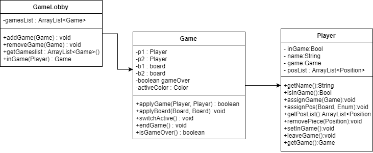

# PROJECT Design Documentation

# Team Information
* Team name: KOTD (Team d)
* Team members
    * Robert Kurdziel
    * AJ Nagashima
    * William Raffaelle
    * George Pinal
    * Kerri Zalba

## Executive Summary

This is a summary of the project.

### &nbsp;Purpose
Create an online checkers game.

### &nbsp;Glossary and Acronyms

| Term | Definition |

|------|------------|

| VO | Value Object |

| MVP | Minimum Viable Product |

## Requirements

&nbsp;&nbsp;&nbsp;&nbsp;The features we have in our application include:
* Creating an alphanumeric username that is not already taken
* Challenge a player to a game when they are both not already in one. In which case it pulls both players into a game page together
* When one player is already in a game it makes the other player wait to play a game with them
* Allows the players to take turns moving their pieces
* Allows players to capture each others pieces
* Allows pieces to become king when the end of the board is reached
* Allows players to win or lose a game
* Allows players to log out

### &nbsp;Definition of MVP
&nbsp;&nbsp;&nbsp;&nbsp;&nbsp;&nbsp;&nbsp;&nbsp;Minimum Viable Product

### &nbsp;MVP Features
* Sign-in: Players must be able to sign into the checkers site
* Game start: Players must be able to start a game with another person
* Gameplay: Players must be able to play a game that follows the American checkers rule set

### &nbsp;Roadmap of Enhancements
* Spectate: Players must be able to watch an ongoing game between two other players
* Replay: Players must be able to save previous matches and watch it again

## Application Domain

&nbsp;&nbsp;&nbsp;&nbsp;The application domain has a GameLobby that keeps track of all the games server wide and a PlayerLobby that
keeps track of all the players server wide and a Game that keep track of the game and the players playing the
game. There is also a MasterEnum to keep track of all the enumerations in one place and a Message to give an
error message or an info message to the player. The Game assigns the players to a specific game and gives them
an opponent to play against and assigns them their colors. It also holds the moves that each player can use
and if the game is over or not.

### &nbsp;Overview of Major Domain Areas

&nbsp;&nbsp;&nbsp;&nbsp;The model has a Board and a BoardView. The Board is of type Space and the BoardView is used to show the Board
for the current player. Each Space object on the Board can contain a Piece if it is a white Piece. Piece is
an abstract class; the two types of Pieces are type Pawn and type King. Each Piece has a Position so that we
can figure out where it is located on the Board and what Space it is in, and it also has an equals function in
it that allows you to see if two Pieces are at the same Position. Player holds a Position list of all the
Player's Pieces on the board. The Row holds the Spaces per the size of the Board.

### &nbsp;Details of each Domain Area

&nbsp;&nbsp;&nbsp;&nbsp;Space has a function validSpace that returns whether or not that Space is one that can be moved onto. It also
holds the kingMe function that returns when the Piece gets to the end of the Board it can become a King. The
Row holds the amount of Spaces and uses what the dimensions of the Board that is passed into the constructor
to see how many Spaces need to be added. The Position class helps us to determine where Pieces are located on
the Board so that we can determine if the Space is valid to move onto or not. The Player class assigns the
Players to a game and can tell whether or not the Player is in a game so that another Player can't try to
start a game with them. It also assigns the Position of the Piece when the Player makes a move and keeps a
list of the moves that were made. It also allows the Player to remove a Piece if they want to retract a move
and it allows them to leave a game which then deletes all the moves they made in that game. Piece sets up the
Pieces with their colors and the type of Piece (ie King or Pawn). It also has an equals() function that is
used to see if there is a Piece already on a Space so that it can help in checking if the Space is valid or
not. It is also an Abstract class so that Pawn and King can pull from it. Pawn is a child of Piece and it is
used to determine the functionality of how it can move vs Piece's other child class, King, which can move
differently than a Pawn can. Move keeps the Position start and ends and what happens in between so it is easy
to backtrack through the move list and figure out what has been done. BoardView is for the HTML, it changes
the Board display for each player so that they can each see it like they are the red player. This is for the
user because it makes the game and the view of the game a little bit friendlier for them. Board initializes
the Board for the Players and is made up of Spaces. This allows there to be Pieces added on the Spaces. It
also contains a validMoves function that returns a list of the moves that can be made and it has a validJumps
function as well that determines whether a jump is valid. It also has a makeMove function which allows a move
to be made and also an inverseMove which allows the move that was made to be backtracked.

## Architecture

&nbsp;&nbsp;&nbsp;&nbsp;This section describes the webapp's architecture, and lays out the states of its behavior.

### &nbsp;Summary

&nbsp;&nbsp;&nbsp;&nbsp;The application of the program spans three tiers: appl, model, ui. Users interact with the UI by moving
pieces on the board. The application tier holds the logic that allows moves to be valid. The model holds the core 
domain, which in this case is the game board, its spaces, and the spaces pieces. 

### &nbsp;Overview of User Interface

&nbsp;&nbsp;&nbsp;&nbsp;The program begins by making a GET to the home page. The player signs in which invokes a POST sign in. If successful,
the player can then choose another signed in player to play against and a GET is made to the game page. Here the player
can make a move. First, there is a POST to validate the move, then there is a POST to submit the move.

### &nbsp;Tier UI

&nbsp;&nbsp;&nbsp;&nbsp;The UI tier allows the player to sign in, play games, make moves, and resign. GET routes handle getting the different
pages (Home, SignIn, Game). POST routes allow the player to sign in, make moves, backup moves, and resign.

### &nbsp;Tier com.webcheckers.model

&nbsp;&nbsp;&nbsp;&nbsp;The com.webcheckers.model tier hold the board object. The board is comprised of Spaces which all have a reference to the Piece object
on them. The King and Pawn classes make sure that the proper move functionality in used.

### &nbsp;Tier appl

&nbsp;&nbsp;&nbsp;&nbsp;The appl tier manages the games that are created in GameLobby and PlayerLobby. When players sign in they are sent to the
PlayerLobby, and when challenged that are sent to the GameLobby. The GameLobby must assign players to games and also handle
the case that somebody resigns. 

## Sub-systems

&nbsp;&nbsp;&nbsp;&nbsp;The UI components GetHomeRoute, GetSignInRoute, and GetGameRoute ensure that the user can view the game, and the
Application component gamelobby serves to provide additional data to streamline their interactions in determining movement of players from
home to game. The Model components Board, Row, and Space contain important logic for the game itself.

### &nbsp;Purpose of the sub-systems

#### &nbsp;&nbsp; UI Home, Signin, and Game routes
&nbsp;&nbsp;&nbsp;&nbsp;&nbsp;&nbsp;&nbsp;&nbsp;These components provide a game page for the user to view and interact with. Beyond just fulfilling this duty,
they interact with one another while checking the status of the current player versus the gamelobby in the application, which is important in doing two things:
adding players to their respective games when they are challenged by or have selected a suitable opponent, and ensuring that players cannot be left behind when
clicking out of the game and attempting to reload into the homepage in the middle of a game.

#### &nbsp;&nbsp; Model Board & Subcomponents
&nbsp;&nbsp;&nbsp;&nbsp;These components interact in their initialization to produce a board suitable to follow movement and jumping logic.
Board's constructor produces a square matrix of size 8 of unique Space Objects.
Board's methods validMoves and validJumps work seperately in constructing a list
of legal checkers moves using the type of piece held in the Spaces relevant to
the state of the board. These methods are called by updateMoveList, which is
called by getMoves, which is the exit point of the subsystem via proxy of its
information expert, Board.

### &nbsp;Static models

### &nbsp;Dynamic models
#### &nbsp;&nbsp;State Chart 
&nbsp;&nbsp;&nbsp;&nbsp;
#### &nbsp;&nbsp;Sequence Diagram 
&nbsp;&nbsp;&nbsp;&nbsp;